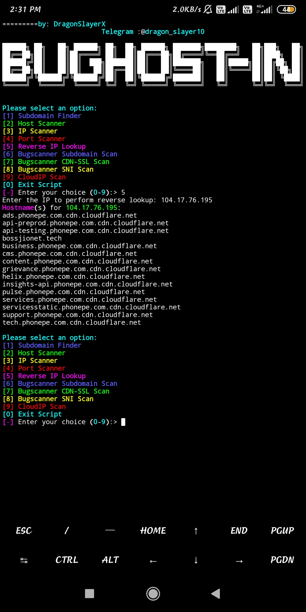

# BugHost-IN Hunting Tool

## Description
BugHost-IN is a Python script designed for bughost hunt, featuring subdomain discovery, host scanning, IP scanning, port scanning, reverse IP lookup, and integration with Bugscanner for additional scanning capabilities. The tool utilizes libraries for networking, web requests, asynchronous tasks, and rich console output.

## Dependencies
- Python 3.x
- Requests
- Rich
- Aiohttp
- Cfscrape
- Colorama
- Bugscanner (Note: Bugscanner should be installed separately)

## Usage Instructions

1. Run the following commands to ensure your environment is set up correctly:

    ```bash
    pkg update && pkg upgrade -y
    pkg install python
    pkg install python3
    pkg install golang
    pkg install vim
    ```

2. Install Python packages and Bugscanner:

    ```bash
    pip install requests loguru multithreading bugscanner
    ```

3. Clone the BugHost-IN repository:

    ```bash
    git clone https://github.com/gayankumar6398/BugHost-IN.git
    cd BugHost-IN/subdomain
    ```

4. Install required Python packages:

    ```bash
    pip install -r requirements.txt
    ```

5. Add Go binary path to your environment:

    ```bash
    echo 'PATH="$PATH:$HOME/go/bin"' >> $HOME/.bashrc && source $HOME/.bashrc
    ```

6. Run the BugHost-IN script:

    ```bash
    python3 scan.py
    ```

Now, BugHost-IN is ready to use. Follow the on-screen prompts to navigate through the tool's functionalities.

### Main Menu Options:

- **1. Subdomain Finder:** Discover subdomains for a given hostname.

- **2. Host Scanner:** Scan hosts from a `hosts.txt` file for information such as IP address, server type, and HTTP status code.

- **3. IP Scanner:** Scan IP addresses for connectivity, Cloudflare association, and open ports.

- **4. Port Scanner:** Scan for open ports on a specified IP address or CIDR range.

- **5. Reverse IP Lookup:** Perform a reverse IP lookup to find hostnames associated with a given IP address.

- **6. Bugscanner Subdomain Scan:** Integration with Bugscanner to perform a subdomain scan using a specified proxy and target port.

- **7. Bugscanner CDN-SSL Scan:** Integration with Bugscanner to perform a CDN-SSL scan with a specified proxy and target.

- **8. Bugscanner SNI Scan:** Integration with Bugscanner to perform an SNI scan.

- **9. CloudIP Scan:** Scan an IP range for Cloudflare presence and check HTTP/HTTPS connectivity.

- **0. Exit Script:** Exit the script.

## Screenshots


*Figure 1: BugHost-IN Subdomain Finder in action.*


*Figure 2: BugHost-IN Host Scanner displaying results.*


*Figure 3: BugHost-IN IP Scanner detecting Cloudflare association.*


*Figure 4: BugHost-IN Port Scanner identifying open ports.*


*Figure 5: BugHost-IN Reverse IP Lookup listing hostnames associated with an IP.*


*Figure 6: BugHost-IN Bugscanner Subdomain Scan with proxy and target specified.*


*Figure 7: BugHost-IN Bugscanner CDN-SSL Scan with proxy and target specified.*


*Figure 8: BugHost-IN Bugscanner SNI Scan results.*


*Figure 9: BugHost-IN CloudIP Scan checking IP range for Cloudflare presence.*

## Notes
- Bugscanner integration requires Bugscanner to be installed separately.
- The script provides a rich console interface for better user experience.
- Make sure to have the necessary dependencies installed before running the script.
- Follow the prompts and input requirements for each specific functionality.

Feel free to explore and enhance this BugHost-IN tool according to your needs.
